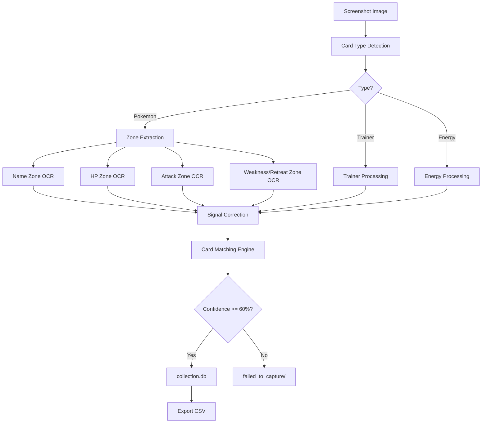
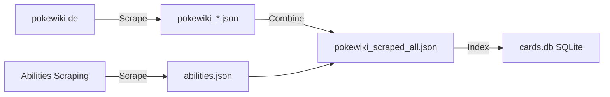
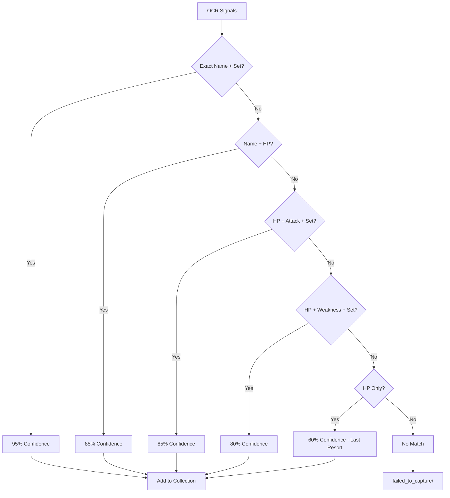
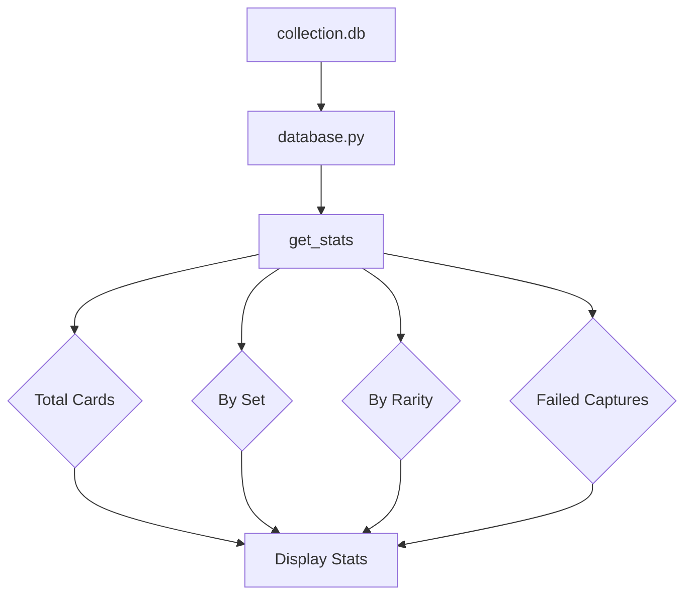

# Pokemon TCG Pocket Card Extractor

A computer vision + OCR system to automatically extract and catalog Pokemon TCG Pocket cards from screenshots.

# Data Workflow

This document shows the data flow through the Pokemon TCG Pocket card extraction system.

## Card Extraction Pipeline



## Database Sources



## Card Matching Priority



## Data Schema

### Input: Screenshot
```
PKM_CARDS/A1/card_001.png
```

### After OCR: Signals
```json
{
  "name": "Darkrai-ex",
  "hp": "130",
  "attacks": ["Finstere Flut"],
  "weakness": "Fire+20",
  "retreat": "2"
}
```

### Database Match: Card Data
```json
{
  "german_name": "Darkrai-ex",
  "set_id": "A2",
  "set_name": "Kollision von Raum und Zeit",
  "hp": "130",
  "energy_type": "Psychic",
  "stage": "Stage 1",
  "attacks": [{"name": "Finstere Flut", "damage": "130"}],
  "weakness": "Fire+20",
  "retreat": "2",
  "ability": "Schattendolch",
  "ability_effect": "...",
  "rarity": "4 Star"
}
```

### Collection Storage
```
collection.db → cards table
├── name: Darkrai-ex
├── set_name: A2
├── hp: 130
├── quantity: 1
└── ... (all card fields)
```

## File Transformations

```mermaid
flowchart LR
    subgraph Input
        A[Screenshot]
    end
    
    subgraph Processing
        B[extract_batch_v2.py]
        C[EasyOCR]
        D[local_lookup.py]
    end
    
    subgraph Cache
        E[pokewiki_scraped_all.json]
        F[abilities.json]
    end
    
    subgraph Output
        G[collection.db]
        H[collection_export.csv]
        I[failed_to_capture/]
    end
    
    A --> B
    B --> C
    C --> D
    D --> E
    D --> F
    E --> D
    F --> D
    D --> G
    G --> H
    D --> I
```



## Collection Statistics Flow



## Scraping Workflow

```mermaid
flowchart TD
    A[pokewiki.de Set Page] --> B[scrape_pokewiki.py]
    B --> C[Extract Card Links]
    C --> D[For Each Card]
    D --> E[Fetch Card Page]
    E --> F[Parse HTML]
    F --> G[Extract Data]
    G --> H[pokewiki_{set}.json]
    
    I[pokewiki.de Card Page] --> J[scrape_abilities.py]
    J --> K[Find Cards with Power]
    K --> L[Extract Ability]
    L --> M[abilities.json]
    
    H --> N[Combine All Sets]
    M --> N
    N --> O[pokewiki_scraped_all.json]
```


## Overview

This system captures card images from the Pokemon TCG Pocket mobile app, uses OCR to extract card information, and matches against a comprehensive card database to build a collection tracker.

## Architecture

```
┌─────────────────┐     ┌──────────────────┐     ┌─────────────────┐
│  Screenshots   │────▶│  extract_batch   │────▶│  collection.db  │
│  (PKM_CARDS)   │     │  _v2.py          │     │  (SQLite)       │
└─────────────────┘     └──────────────────┘     └─────────────────┘
                                │
                                ▼
                        ┌──────────────────┐
                        │  local_lookup   │
                        │  (matching)      │
                        └──────────────────┘
                                │
                                ▼
                        ┌──────────────────┐
                        │ pokewiki_        │
                        │ scraped_all.json │
                        │ (Card Database)  │
                        └──────────────────┘
```

## Workflow

### 1. Image Input

Cards are sourced from:
- **PKM_CARDS/{SET}/** - Organized by set (e.g., `PKM_CARDS/A1/`)
- **screenshots/to_process/** - Fallback folder

Each image should contain a single Pokemon TCG Pocket card.

### 2. Card Type Detection (`extraction/`)

Before OCR, the system detects what type of card it is:
- Pokemon cards (with HP, attacks, abilities)
- Trainer cards (Item, Supporter, Stadium)
- Energy cards

### 3. Image Preprocessing (`preprocessing/`)

1. **CardCropper** - Detects and crops the card region
2. **Zone extraction** - Separates card into zones:
   - Name zone
   - HP zone  
   - Attack/Ability zone
   - Weakness/Retreat zone

### 4. OCR Processing (`ocr_engine/`)

Uses **EasyOCR** and **Tesseract** to extract:
- Card name (often unreliable from game UI)
- HP value
- Attack names and costs
- Ability name and effect
- Weakness type
- Retreat cost
- Card number/set info

**OCR Error Correction:**
- HP values are corrected (e.g., "502" → "50", "802" → "80")
- Image enhancement (contrast, gamma correction) applied before OCR

### 5. Card Matching (`api/local_lookup.py`)

The extracted signals are matched against the card database:

#### Matching Priority:
1. **Exact name + set** (95% confidence)
2. **Name + HP** (85% confidence)
3. **HP + Attack + Set** (85% confidence)
4. **HP + Weakness + Set** (80% confidence)
5. **HP only** (60% confidence - last resort)

#### Database Sources:
- **Primary:** German cards from pokewiki.de (`pokewiki_scraped_all.json`)
  - ~2541 cards across all TCG Pocket sets (A1-B2a, PROMO-A, PROMO-B)
  - Includes abilities, attacks, weaknesses, retreat costs
  - Card images available in `card_images.json`

### 6. Collection Storage (`collection.db`)

SQLite database storing:
- Card name, set, card number
- HP, stage, energy type
- Evolution info
- Ability and attacks
- Weakness, resistance, retreat cost
- Rarity, illustrator
- **Quantity** (for tracking duplicates)

### 7. Results

- **High confidence (≥60%):** Added to collection.db
- **Low confidence (<60%):** Saved to `failed_to_capture/` for manual review
- **Exported:** CSV export available via `database.export_csv()`

## Data Files

### `api/cache/pokewiki_scraped_all.json`
Main card database - combined JSON with all scraped cards.

**Structure:**
```json
{
  "url": "https://www.pokewiki.de/Bisasam_(Unschlagbare_Gene_001)",
  "german_name": "Bisasam",
  "set_id": "A1",
  "set_name": "Unschlagbare Gene",
  "card_number": "1",
  "hp": "70",
  "energy_type": "Grass",
  "stage": "Basic",
  "evolution_from": "",
  "weakness": "Fire+20",
  "retreat": "1",
  "attacks": [{"name": "Rankenhieb", "damage": "40", "cost": ["Grass", "Colorless"], "effect": ""}],
  "ability": null,
  "ability_effect": null,
  "rarity": "2 Diamond",
  "illustrator": "",
  "pokedex_number": "0001",
  "regulation_mark": "A"
}
```

### `api/cache/abilities.json`
Scraped Pokemon abilities (~124 unique abilities).

### `api/cache/cards.db`
SQLite database derived from JSON for fast lookups.

### Individual Set Files
`pokewiki_{set_id}.json` - Separate JSONs per set (A1, A2, A3, etc.)

## Sets Supported

| Set ID | Name (German) |
|--------|--------------|
| A1 | Unschlagbare Gene |
| A2 | Kollision von Raum und Zeit |
| A3 | Licht des Triumphs |
| A3a | Dimensionale Krise |
| A3b | Evoli-Hain |
| A1a | Mysteriöse Insel |
| A2a | Hüter des Firmaments |
| A2b | Weisheit von Meer und Himmel |
| A4a | Verborgene Quelle |
| B1 | Wundervolles Paldea |
| B2 | Traumhafte Parade |
| PROMO-A | PROMO-A |
| PROMO-B | PROMO-B |

## Usage

### Quick Start

```bash
# Run extraction (interactive - select set or process all)
./run.sh

# Or run directly
python3 extract_batch_v2.py run
python3 extract_batch_v2.py run --set A1
```

### Python API

```python
from database import add_card, get_all_cards, get_stats
from api.local_lookup import lookup_card

# Lookup a card
result = lookup_card('Darkrai-ex', hp='130', target_set='A2')
if result.success:
    print(f"Found: {result.card.name}")
    add_card(result.card.__dict__)

# Get collection stats
stats = get_stats()
print(f"Total cards: {stats['total_unique']}")
```

### Export Collection

```python
from database import export_csv
export_csv('my_collection.csv')
```

## Scraping (Data Collection)

The card database was built by scraping pokewiki.de:

### Scraping Card Data
```bash
python3 api/scrapers/scrape_pokewiki.py
```

### Scraping Abilities
```bash
python3 api/scrapers/scrape_abilities.py
```

Data is saved to `api/cache/` as JSON files.

## Project Structure

```
tcgp/
├── api/
│   ├── cache/              # Card data (JSON, SQLite)
│   │   ├── pokewiki_scraped_all.json
│   │   ├── abilities.json
│   │   ├── cards.db
│   │   └── pokewiki_*.json  # Individual sets
│   ├── scrapers/           # Web scrapers
│   │   ├── scrape_pokewiki.py
│   │   └── scrape_abilities.py
│   ├── local_lookup.py    # Card matching logic
│   └── models.py          # Data models
│
├── extraction/            # Card detection
│   ├── card_type.py
│   └── zone_extractor.py
│
├── preprocessing/        # Image preprocessing
│   └── card_cropper.py
│
├── ocr_engine/           # OCR implementation
│
├── validation/          # Validation logic
│
├── screenshots/         # Input images
│   └── to_process/
│
├── test_debug/          # Debug/test files
│
├── extract_batch_v2.py  # Main extraction script
├── database.py          # Collection database
├── collection.py        # Collection management
└── run.sh              # Run script
```

## Key Components

### `extract_batch_v2.py`
Main entry point. Coordinates:
1. Image loading
2. Card type detection
3. Zone extraction
4. OCR processing
5. Signal correction
6. Database matching
7. Collection storage

### `database.py`
SQLite operations:
- `add_card()` - Add with quantity tracking
- `remove_card()` - Decrement/delete
- `get_stats()` - Collection statistics
- `export_csv()` - Export to CSV

### `api/local_lookup.py`
Matching logic with multiple strategies:
- `lookup_card()` - Primary lookup by name
- `match_by_signals()` - Multi-signal matching
- `match_by_pokedex()` - Pokédex number matching

## Configuration

### OCR Settings
Edit `extract_batch_v2.py`:
```python
READER = easyocr.Reader(['de', 'en'], gpu=False)
```

### Confidence Threshold
Default: 60% - edit in `extract_batch_v2.py`

## Troubleshooting

### Low OCR Accuracy
- Ensure card images are clear and well-lit
- Check `preprocessing/` for enhancement options
- Adjust EasyOCR settings in `extract_batch_v2.py`

### Matching Failures
- Verify card is in `pokewiki_scraped_all.json`
- Try running with `--debug` flag
- Check failed captures in database

### Missing Cards
- Run scraper to update database
- Manually add to JSON if needed

## License

This project is for personal use with Pokemon TCG Pocket card data scraped from pokewiki.de (German wiki).
