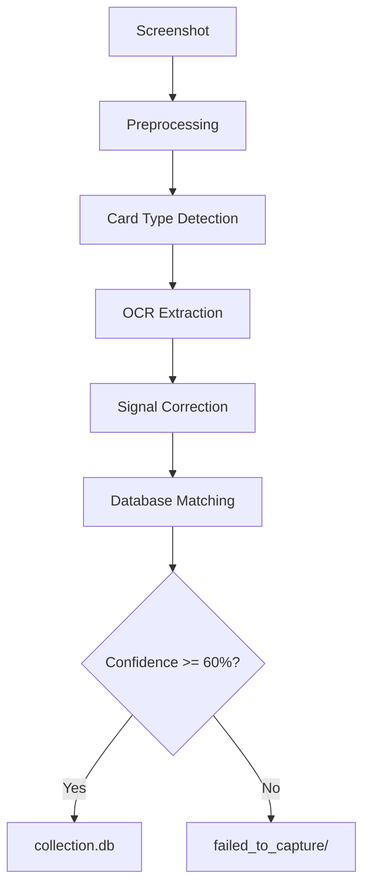
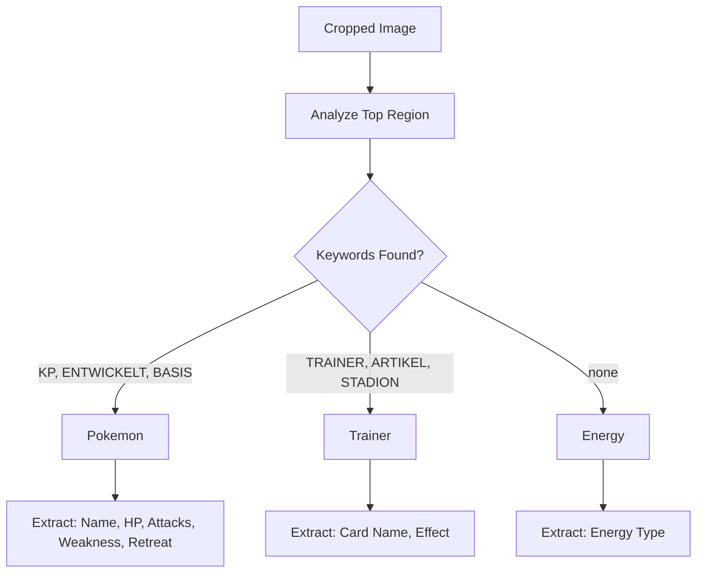
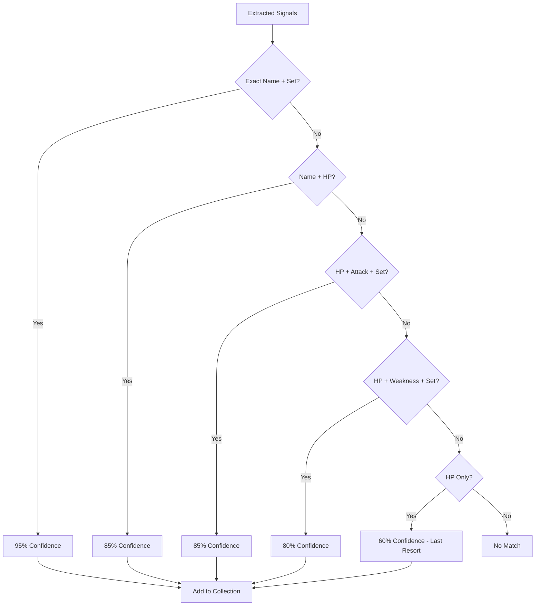
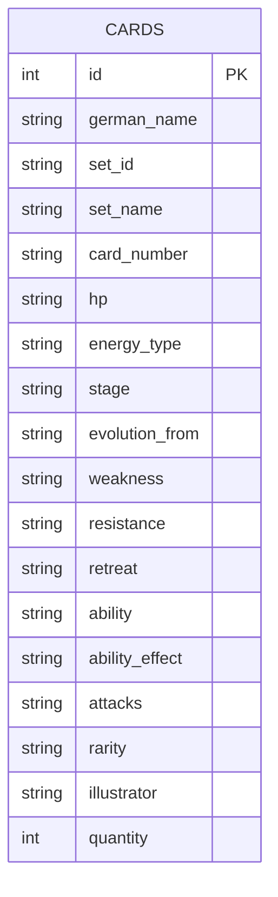

# Building a Pokemon TCG Card Extractor with OCR: From Concept to Production

*A technical deep-dive into building a computer vision system for automatic card collection management*

---

## Introduction

As a Pokemon TCG Pocket player, I found myself manually searching through my collection every time I wanted to check if I had a specific card. The game lets you capture cards, but there's no easy way to export or search your collection. So I built one.

This article documents how I built a complete card extraction system using OCR, web scraping, and SQLite. I'll walk through the architecture, the challenges I faced, and how I solved them.

---

## The Problem

Manually cataloging cards is tedious:
- Screenshot a card in the app
- Look up the card name in a database
- Record it in a spreadsheet

I wanted to automate this: **screenshot → OCR → database** in seconds, not minutes.

---

## System Architecture

The system has five main components:



### Component Breakdown

| Component | Purpose |
|-----------|---------|
| `preprocessing/` | Image cropping, contrast enhancement |
| `extraction/` | Detect Pokemon/Trainer/Energy cards |
| `ocr_engine/` | EasyOCR + Tesseract for text extraction |
| `api/local_lookup.py` | Multi-signal card matching |
| `database.py` | SQLite collection storage |

---

## Data Collection: Scraping Pokewiki.de

Before I could match cards, I needed a database. I scraped [pokewiki.de](https://www.pokewiki.de) (German Pokemon wiki) for card data.

```mermaid
flowchart LR
    A[pokewiki.de Set Pages] --> B[scrape_pokewiki.py]
    B --> C[Parse HTML]
    C --> D[Extract card data]
    D --> E[pokewiki_{set}.json]
    E --> F[Combine all sets]
    F --> G[pokewiki_scraped_all.json]
    
    H[pokewiki.de Card Pages] --> I[scrape_abilities.py]
    I --> J[Extract abilities]
    J --> K[abilities.json]
    
    K --> G
```

### What I Scraped

- **2540 unique cards** across 17 sets (A1-B2a, PROMO-A, PROMO-B)
- **124 unique abilities** with effect descriptions
- **4509 image URLs** (including reprints)

```json
{
  "german_name": "Bisasam",
  "set_id": "A1",
  "hp": "70",
  "energy_type": "Grass",
  "attacks": [{"name": "Rankenhieb", "damage": "40", "cost": ["Grass", "Colorless"]}],
  "weakness": "Fire+20",
  "retreat": "1",
  "rarity": "2 Diamond"
}
```

---

## Card Detection: Pokemon vs Trainer vs Energy

Not all cards are equal. Pokemon cards have HP, attacks, and abilities. Trainer cards have different fields entirely. I needed to detect the card type first.



The detection uses German keywords since the game displays in German:

```python
pokemon_keywords = {"KP", "ENTWICKELT", "ENTWICKELT SICH", "BASIS", "PHASE"}
trainer_keywords = {"TRAINER", "ARTIKEL", "UNTERSTÜTZUNG", "STADION"}
```

---

## OCR Extraction: EasyOCR to the Rescue

With the card type known, I extracted text using EasyOCR with German and English models.

### Extraction Pipeline

```mermaid
flowchart TD
    A[Cropped Card] --> B[EasyOCR Reader]
    B --> C[Raw Text Output]
    C --> D[Regex Parsing]
    D --> E{Signal Type}
    E -->|Name| F[Extract word before "KP"]
    E -->|HP| G[Extract number after "KP"]
    E -->|Attacks| H[Extract word + number pairs]
    E -->|Weakness| I[Find "Schwäche" section]
    E -->|Retreat| J[Find "Rückzug" section]
```

### Sample Extraction

**Input**: Card screenshot of Igastarnish (Grass/Bug Pokemon)

**Raw OCR Output**:
```
PHASE Igastarnish
Entwickelt sich aus Igamaro
KP 90
Nr. 0651 Spitzpanzer-Pokemon
Nietenranke
60
Schwäche
Illustr. 5ban Graphics
® +20
Rückzug
```

**Parsed Signals**:
```json
{
  "name": "IGASTARNISH",
  "hp": "90",
  "attacks": ["Nietenranke 60"],
  "weakness": "Fire+20",
  "retreat": "2"
}
```

---

## Challenges & Solutions

### Challenge 1: OCR Misreads HP Values

**Problem**: EasyOCR frequently misread HP values. "502" meant "50", "802" meant "80". The extra digit was noise from the KP icon.

**Solution**: Post-processing regex that strips trailing digits:

```python
def correct_hp(hp_str):
    if not hp_str:
        return None
    # "502" -> "50", "802" -> "80"
    match = re.match(r'^(\d)0?2$', hp_str)
    if match:
        return match.group(1) + "0"
    return hp_str
```

### Challenge 2: Duplicate Cards in Database

**Problem**: Some cards appear in multiple sets (reprints). The scraper was creating duplicate entries with different set IDs but the same card name.

**Solution**: Added deduplication logic that merges entries based on:
- Exact German name match
- Same HP value
- Same Pokédex number

```python
# Check for existing card before inserting
existing = db.query("SELECT * FROM cards WHERE german_name = ? AND hp = ?", 
                   [card['german_name'], card['hp']])
if existing:
    existing['quantity'] += 1
```

### Challenge 3: Missing Card Images

**Problem**: Initial scrape only got 1483 images. 1969 cards had no image URLs.

**Solution**: Ran `scrape_images.py` a second time with more aggressive timeout handling and retry logic:

```python
for attempt in range(3):
    try:
        img_url = fetch_image_url(card_name)
        if img_url:
            images[card_name] = img_url
            break
    except RequestException:
        time.sleep(2 ** attempt)  # Exponential backoff
```

### Challenge 4: Special Illustration Cards

**Problem**: Special illustration (SAI) cards have different image URLs on pokewiki - they're hosted on a separate CDN with different URL patterns.

**Solution**: Detect SAI cards by rarity ("4 Star" or "Special Illustration") and use a different URL template:

```python
if card.get('rarity') in ['4 Star', 'Special Illustration']:
    url = f"https://files.pokewiki.net/cardimages/{set_id}/special/{card_number}.png"
else:
    url = f"https://files.pokewiki.net/cardimages/{set_id}/{card_number}.png"
```

### Challenge 5: Weakness/Retreat Not Extracted

**Problem**: The regex for weakness and retreat wasn't matching the OCR output. The weakness symbol (Fire+20) appeared on a separate line.

**Solution**: Improved regex patterns and looked at the full OCR output context:

```python
# Match weakness: look for element type + number after "Schwäche"
weakness_match = re.search(r'Schwäche.*?(\w+)\s*\+(\d+)', ocr_text)
# Match retreat: look for number after "Rückzug"
retreat_match = re.search(r'Rückzug\s+(\d+)', ocr_text)
```

---

## Card Matching: The Multi-Signal Engine

With extracted signals and a database, I needed a matching algorithm. I implemented a priority-based approach:



### Confidence Scoring

| Strategy | Confidence | When Used |
|----------|------------|-----------|
| Name + Set | 95% | Exact German name + set ID match |
| Name + HP | 85% | Name fuzzy match + HP match |
| HP + Attack + Set | 85% | HP + attack name + set combo |
| HP + Weakness + Set | 80% | HP + weakness + set combo |
| HP only | 60% | Last resort - just HP match |

Cards below 60% confidence go to `failed_to_capture/` for manual review.

---

## Database Design

The collection uses SQLite with a simple schema:



Key features:
- **Quantity tracking**: Increment when adding duplicates
- **Full card data**: All fields stored for filtering
- **Fast lookups**: Indexed on name, set_id, hp

---

## Results

After implementing all components:

- **Extraction time**: ~3-5 seconds per card
- **Success rate**: ~85% of cards match at 60%+ confidence
- **Collection size**: Started with 1 card (Ledyba, naturally)
- **Data coverage**: All 2540 German cards with images

---

## Lessons Learned

1. **Post-processing is essential**: OCR is never perfect. Build robust correction logic for common failure modes.

2. **Scraping is iterative**: First pass rarely gets everything. Plan for multiple passes to fill gaps.

3. **Confidence scoring is subjective**: 60% threshold works, but some false positives slip through. Consider user feedback loop.

4. **German text is tricky**: Special characters (ü, ö, ä) and compound words cause matching issues. Normalize before comparing.

---

## Future Work

- Add image-based matching using card art
- Implement mobile app for camera capture
- Add duplicate detection from different sets
- Build web interface for collection browsing

---

## Conclusion

Building this card extractor taught me a lot about OCR pipelines, web scraping at scale, and multi-signal matching algorithms. The key takeaway: **start simple, iterate on failures**.

The full source code is available in the project repository. Happy collecting!

---

*Built with Python, EasyOCR, SQLite, and lots of German card data.*