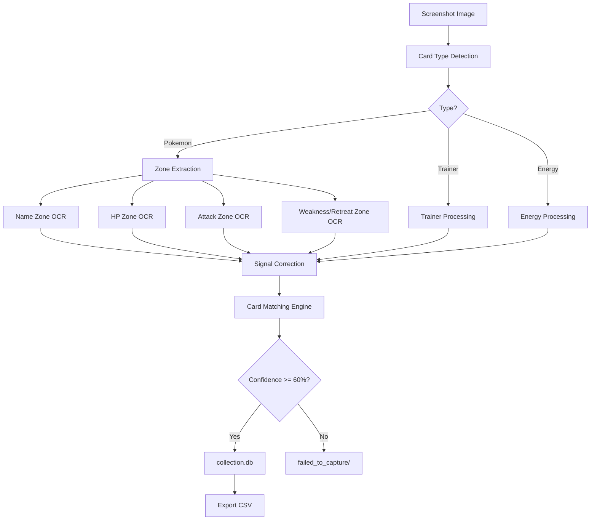
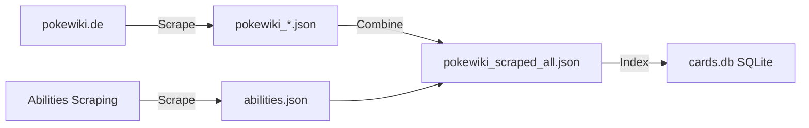
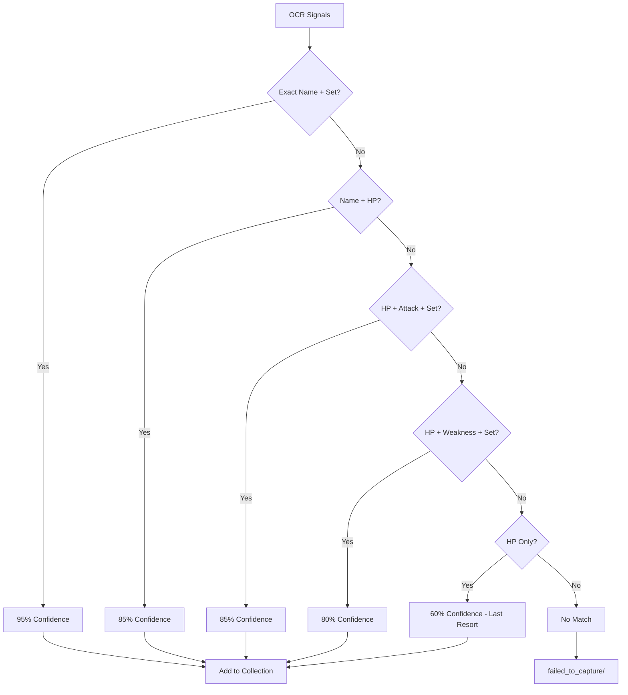
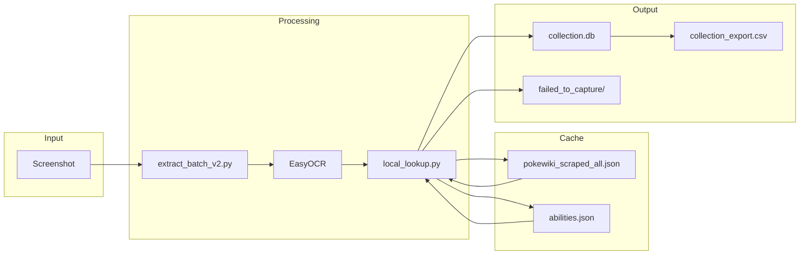
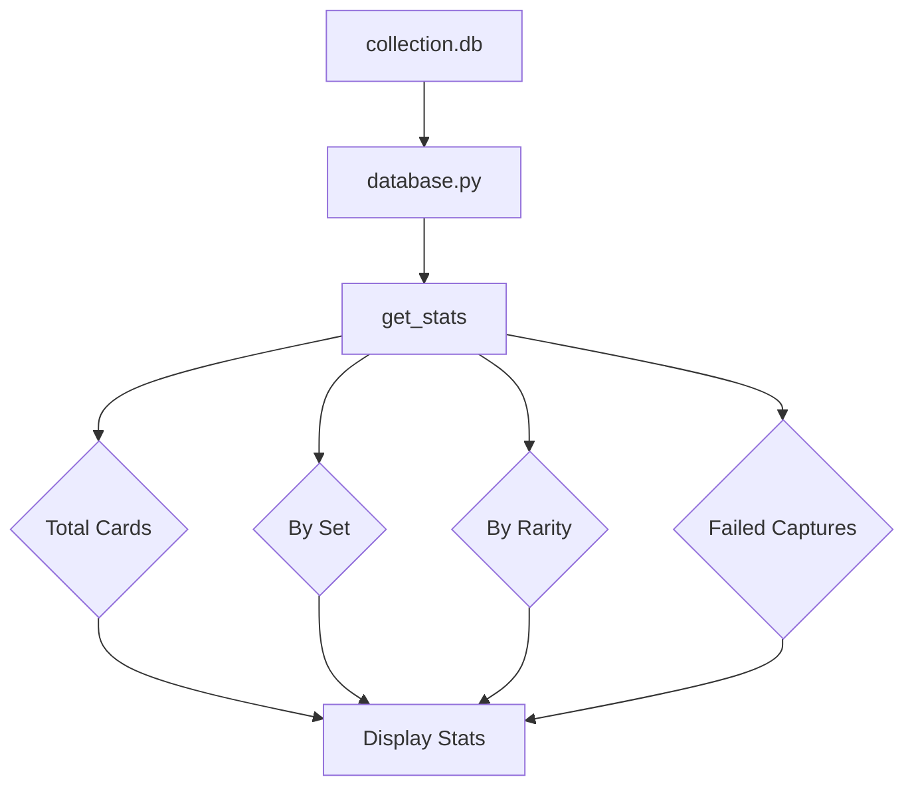

# Data Workflow

This document shows the data flow through the Pokemon TCG Pocket card extraction system.

## Card Extraction Pipeline



## Database Sources



## Card Matching Priority



## Data Schema

### Input: Screenshot
```
PKM_CARDS/A1/card_001.png
```

### After OCR: Signals
```json
{
  "name": "Darkrai-ex",
  "hp": "130",
  "attacks": ["Finstere Flut"],
  "weakness": "Fire+20",
  "retreat": "2"
}
```

### Database Match: Card Data
```json
{
  "german_name": "Darkrai-ex",
  "set_id": "A2",
  "set_name": "Kollision von Raum und Zeit",
  "hp": "130",
  "energy_type": "Psychic",
  "stage": "Stage 1",
  "attacks": [{"name": "Finstere Flut", "damage": "130"}],
  "weakness": "Fire+20",
  "retreat": "2",
  "ability": "Schattendolch",
  "ability_effect": "...",
  "rarity": "4 Star"
}
```

### Collection Storage
```
collection.db → cards table
├── name: Darkrai-ex
├── set_name: A2
├── hp: 130
├── quantity: 1
└── ... (all card fields)
```

## File Transformations



## Collection Statistics Flow



## Scraping Workflow

```mermaid
flowchart TD
    A[pokewiki.de Set Page] --> B[scrape_pokewiki.py]
    B --> C[Extract Card Links]
    C --> D[For Each Card]
    D --> E[Fetch Card Page]
    E --> F[Parse HTML]
    F --> G[Extract Data]
    G --> H[pokewiki_{set}.json]
    
    I[pokewiki.de Card Page] --> J[scrape_abilities.py]
    J --> K[Find Cards with Power]
    K --> L[Extract Ability]
    L --> M[abilities.json]
    
    H --> N[Combine All Sets]
    M --> N
    N --> O[pokewiki_scraped_all.json]
```
