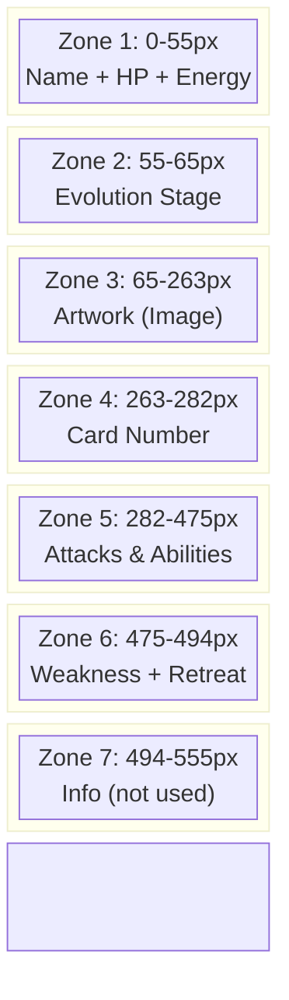
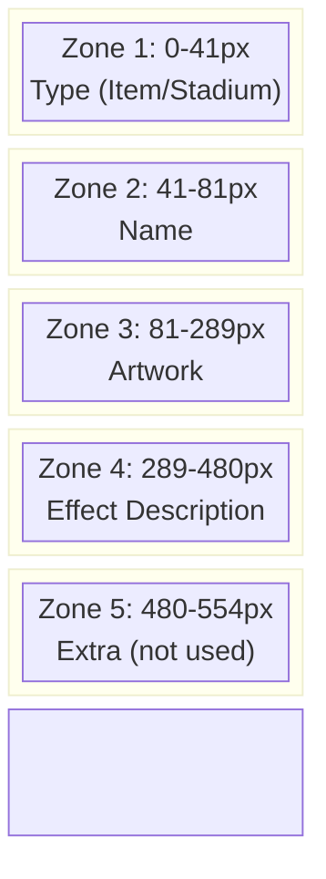
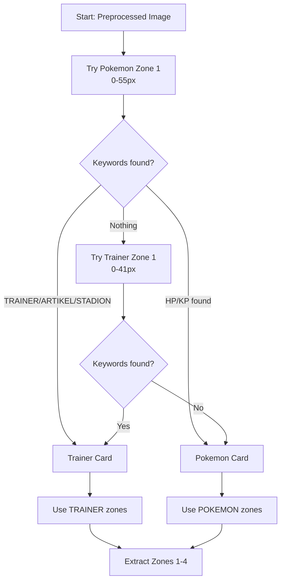
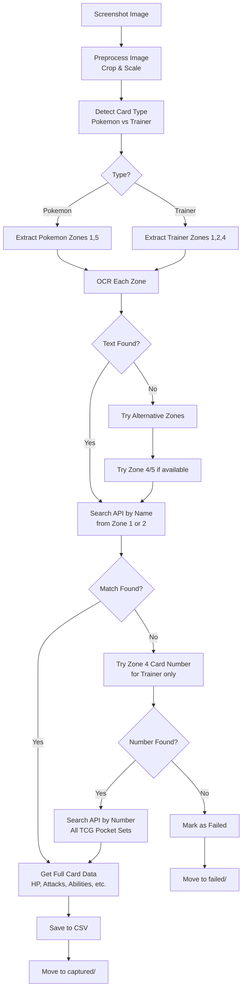

# Pokemon TCG Pocket - Zone Extraction Documentation

## Overview

The extraction process divides card screenshots into **zones** for OCR processing. Each zone contains specific card information that helps identify and extract complete card data.

---

## Image Preprocessing

Before zone extraction, screenshots are preprocessed:

```
Original Image
     │
     ▼
┌─────────────────────────────────────┐
│ 1. Detect orientation (rotate if    │
│    width > height)                  │
└─────────────────────────────────────┘
     │
     ▼
┌─────────────────────────────────────┐
│ 2. Crop sides: 8.5% from each side  │
└─────────────────────────────────────┘
     │
     ▼
┌─────────────────────────────────────┐
│ 3. Crop height: 555px from top      │
│    (14% from top of original)       │
└─────────────────────────────────────┘
     │
     ▼
┌─────────────────────────────────────┐
│ 4. Scale: 4x for better OCR         │
└─────────────────────────────────────┘
     │
     ▼
  Preprocessed Image (555px height)
```

---

## Pokemon Card Zones

The Pokemon card is divided into **7 zones** from top to bottom:



### Pokemon Zone Details

| Zone | Pixels | Height | Content | OCR Purpose |
|------|--------|--------|---------|------------|
| **Zone 1** | 0-55 | 55px | Name + HP + Energy | **Extract for OCR** - Primary identification |
| **Zone 2** | 55-65 | 10px | Evolution stage | Ignored |
| **Zone 3** | 65-263 | 198px | Artwork | Ignored |
| **Zone 4** | 263-282 | 19px | Card number | **API fallback only** - TCG Pocket set numbers don't match general API |
| **Zone 5** | 282-475 | 193px | Attacks + Abilities | **Extract for OCR** - Full text extraction |
| **Zone 6** | 475-494 | 19px | Weakness + Retreat | Ignored |
| **Zone 7** | 494-555 | 61px | Info (not used) | Ignored |

---

## Trainer Card Zones

Trainer cards have a **different layout** with 5 zones:



### Trainer Zone Details

| Zone | Pixels | Height | Content | OCR Purpose |
|------|--------|--------|---------|------------|
| **Zone 1** | 0-41 | 41px | Type (Item, Stadium, Unterstützung) | Card type detection |
| **Zone 2** | 41-81 | 40px | Name | **Extract for OCR** - Primary identification |
| **Zone 3** | 81-289 | 208px | Artwork | Ignored |
| **Zone 4** | 289-480 | 191px | Effect description | **Extract for OCR** - Full text extraction |
| **Zone 5** | 480-554 | 74px | Extra | Ignored |

---

## Card Type Detection Flow



---

## Extraction Process Flow



---

## OCR Configuration

### Zone Preprocessing Pipeline
1. **Crop**: Extract specific zone from preprocessed card image
2. **Greyscale**: Convert to grayscale for better OCR
3. **Scale**: 3-4x scale factor for better text recognition
4. **Contrast**: Minimal contrast enhancement (1.0x)

### Languages
1. **German (deu)** - Primary (matches game language)
2. **English (eng)** - Fallback

### Energy Type Colors (for manual detection)

| German | English | RGB Range |
|--------|---------|-----------|
| Feuer | Fire | (200-255, 50-100, 50-100) |
| Wasser | Water | (50-100, 100-150, 200-255) |
| Elektro | Lightning | (200-255, 200-255, 50-100) |
| Pflanze | Grass | (50-100, 200-255, 50-100) |
| Kampf | Fighting | (200-255, 150-200, 50-100) |
| Psycho | Psychic | (150-200, 50-100, 200-255) |
| Unlicht | Darkness | (50-100, 50-100, 100-150) |
| Metall | Metal | (150-200, 150-200, 150-200) |
| Fee | Fairy | (200-255, 150-200, 200-255) |
| Drache | Dragon | (150-200, 100-150, 50-100) |
| Farblos | Colorless | (200-255, 200-255, 200-255) |

---

## TCG Pocket Sets (Priority Order)

The API searches these sets in priority order when matching card numbers:

| Set Code | Priority | Set Name |
|----------|----------|----------|
| A1 | 10 | Unschlagbare Gene |
| A1a | 10 | Entwicklungen in Paldea |
| A2 | 9 | Kollision von Raum und Zeit |
| A2a | 9 | Strahlende Sternenpracht |
| A2b | 8 | Neue Helden |
| A3 | 8 | Hüter des Firmaments |
| A3a | 7 | Mysterien der Vergangenheit |
| A3b | 7 | Fantastische Abenteuer |
| A4 | 6 | Silberne Sturmwinde |
| A4a | 6 | Stille Wogen |
| Pikachu | 9 | Pikachu |
| ... | ... | ... |

---

## Output CSV Format

| Column | Description | Source |
|--------|-------------|--------|
| Card Name | Pokemon/Trainer name | API |
| HP | Hit points | API |
| Energy Type | Pokemon energy type | API |
| Weakness | Weakness type + value | API |
| Resistance | Resistance type + value | API |
| Retreat Cost | Retreat cost (0-5) | API |
| Category | Pokemon/Trainer | API |
| Ability Name | Ability name | API |
| Ability Description | Ability effect | API |
| Attack 1 Name | First attack name | Zone 5 (OCR) + API |
| Attack 1 Cost | Energy cost | API |
| Attack 1 Damage | Damage value | API |
| Attack 1 Description | Attack effect | Zone 5 (OCR) + API |
| Attack 2 Name | Second attack name | Zone 5 (OCR) + API |
| Attack 2 Cost | Energy cost | API |
| Attack 2 Damage | Damage value | API |
| Attack 2 Description | Attack effect | Zone 5 (OCR) + API |
| Rarity | Rarity (◊, ◊◊, etc.) | API |
| Pack | Set/Pack name | API |

---

## Summary

### Workflow
1. **Preprocess**: Crop screenshot → Zone extraction → Greyscale → Sharpen → Scale
2. **Detect Card Type**: Check Zone 1 for "HP/KP" (Pokemon) or "TRAINER/ARTIKEL" (Trainer)
3. **OCR Extraction**: Extract specific zones for each card type
4. **API Fallback**: Only use API if OCR fails or doesn't provide enough data

### Zones to Extract
- **Pokemon**: Zone 1 (Name+HP) and Zone 5 (Attacks)
- **Trainer**: Zone 1 (Type), Zone 2 (Name), Zone 4 (Effect)

### Critical Zones
- **Pokemon**: Zone 1 and Zone 5 for OCR, Zone 4 as API fallback (limited)
- **Trainer**: Zone 2 and Zone 4 for OCR, Zone 4 as API fallback

### API Usage
- **Last resort only** - OCR is primary method
- Zone 4 card numbers don't match general Pokemon TCG API
- Only TCG Pocket sets (A1, A1a, A2, etc.) work reliably
